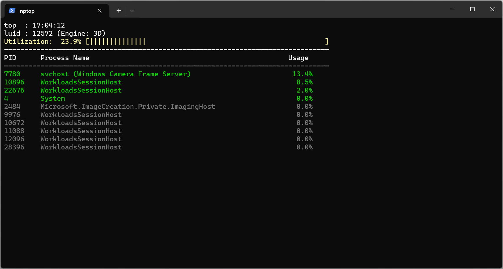

# nptop - Windows NPU Process Monitor

**nptop** is a lightweight, command-line NPU (Neural Processing Unit) performance monitor for Windows, inspired by `top` and `nvtop`.

It is written entirely in **PowerShell**, requiring no external dependencies or installation. By leveraging Windows Performance Counters and native system tools, it provides real-time visibility into NPU usage per process, with advanced features like service name resolution and a responsive, flicker-free interface.


## 📸 Screenshot



## ✨ Key Features

* **Auto-Detection:** Automatically scans Windows Performance Counters to find and select the correct NPU LUID, eliminating the need for manual setup.
* **Zero-Flicker UI:** Uses cursor positioning (`SetCursorPosition`) instead of clearing the screen, ensuring a smooth, artifact-free update cycle.
* **Smart Service Resolution:** Automatically resolves generic `svchost.exe` processes into their full, human-readable service display names (e.g., `svchost (Windows Camera Frame Server)`).
    * *Performance Optimized:* Uses a pre-built hash table cache and fast CSV parsing via `tasklist` to minimize CPU overhead.
* **Smart Sorting:** Focuses on what matters:
    1.  Active processes (>0% usage) float to the top.
    2.  Active processes sorted by Usage (Descending).
    3.  Idle processes sorted by Name (Ascending).
* **Responsive Layout:** Automatically detects window resize events and adjusts layout/padding to prevent ghosting or scrolling issues.
* **Clean Launcher:** Includes a batch launcher that runs the monitor in a separate, dedicated window that closes automatically upon exit.

## 🚀 Getting Started

### 1. Prerequisites
* Windows 10/11
* An NPU (Intel AI Boost, AMD Ryzen AI, Qualcomm Hexagon, etc.)
* PowerShell 5.1 or PowerShell 7+ (pwsh)

### 2. Usage
Simply double-click **`run_nptop.bat`**.

* This will launch the monitor in a new window.
* The script will automatically detect your NPU and begin monitoring.
* The execution policy will be bypassed temporarily for this session.
* Press **`Ctrl+C`** to stop the monitor; the window will close automatically.

### 3. Optional Configuration
By default, the script auto-detects your NPU. If you have multiple hardware accelerators and need to target a specific one, you can configure the script manually:

1.  Open **Task Manager** -> **Performance** tab.
2.  Select your **NPU**.
3.  Find the **LUID** (Locally Unique Identifier) or the device instance ID.
4.  Open `nptop.ps1` in a text editor.
5.  Modify the `$targetLuid` variable at the top of the file:

    ```powershell
    # [Config] Specify your NPU LUID
    # Common examples: "11D3B" (Intel), "00000000-0001-xxxx"
    $targetLuid = "11D3B"
    ```

## ⚙️ Configuration

You can tweak the following variables at the top of `nptop.ps1`:

| Variable | Default | Description |
| :--- | :--- | :--- |
| `$targetLuid` | `$null` | The unique ID of your NPU device. Leave as `$null` for auto-detection. |
| `$interval` | `1` | Sampling refresh rate in seconds. |
| `$maxNameLength` | `60` | Max length for process names before truncation. |
| `$minUtilization`| `0` | Minimum usage % to display. Set to `0` to show all bound processes. |

## 🛠️ How It Works

1.  **Initialization:** The script pre-fetches all Windows Services and builds a `ShortName -> DisplayName` hash map.
2.  **Sampling:** It queries the `\GPU Engine(*luid*)\Utilization Percentage` performance counter (Windows treats NPUs as compute or 3D engines) using wildcards to support both legacy and newer MCDM drivers.
3.  **Enrichment:**
    * For standard processes, it retrieves the name via `Get-Process`.
    * For `svchost.exe`, it executes `tasklist /svc` to get the service key, then looks up the full display name from the memory cache.
4.  **Rendering:** It calculates the window size and prints line-by-line, padding with whitespace to overwrite previous frames without clearing the buffer.

## ⚠️ Troubleshooting

**Q: It says "No active processes" or usage is always 0%.**
A: Your NPU might be asleep, or the LUID auto-detection picked the wrong hardware (e.g., an integrated GPU). Follow the "Optional Configuration" steps to manually assign the correct LUID. You can use the following PowerShell command to list available hardware strings and find your LUID:
`(Get-Counter -ListSet "GPU Engine").PathsWithInstances | Select-String "luid" | Select-Object -First 10`

**Q: The window closes immediately.**
A: This usually means a syntax error or a missing file. Try running `run_nptop.bat` from a command prompt (CMD) to see any error messages before the window closes.

## 📄 License

This project is licensed under the [MIT License](LICENSE).
© 2026 Steve Chang

---

###### tags: `PowerShell` `Windows`
